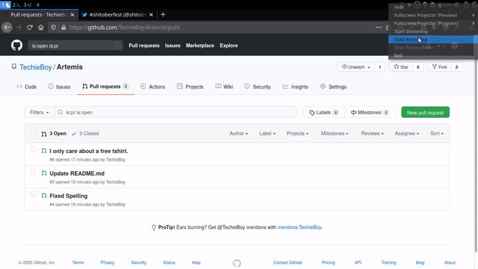

# Hacktoberfest spam killer
Finds low effort PR's in a repo, assigns them the spam label and closes them.

# Why?
[Hacktoberfest](https://hacktoberfest.digitalocean.com/) is a corporate-sponsored [distributed denial of service attack](https://github.com/search?p=5&q=is%3Apr+is%3Aclosed+label%3Aspam+created%3A%3E%3D2020-09-30&type=Issues) against the open source maintainer community.
Inspired by [this article](https://blog.domenic.me/hacktoberfest/) and [this](https://twitter.com/shitoberfest).

# Demo


# How to run
1. Make sure you have python 3.6+ installed. (using venv is recommended)
2. Get your personal access token for github from [here](https://docs.github.com/en/free-pro-team@latest/github/authenticating-to-github/creating-a-personal-access-token)
3. Run the following commands:
```bash
$ pip install PyGithub
$ export GITHUB_PERSONAL_TOKEN=YOUR_TOKEN_HERE
$ python3 killspam.py --repo YOUR_NAME/REPO_NAME
```
